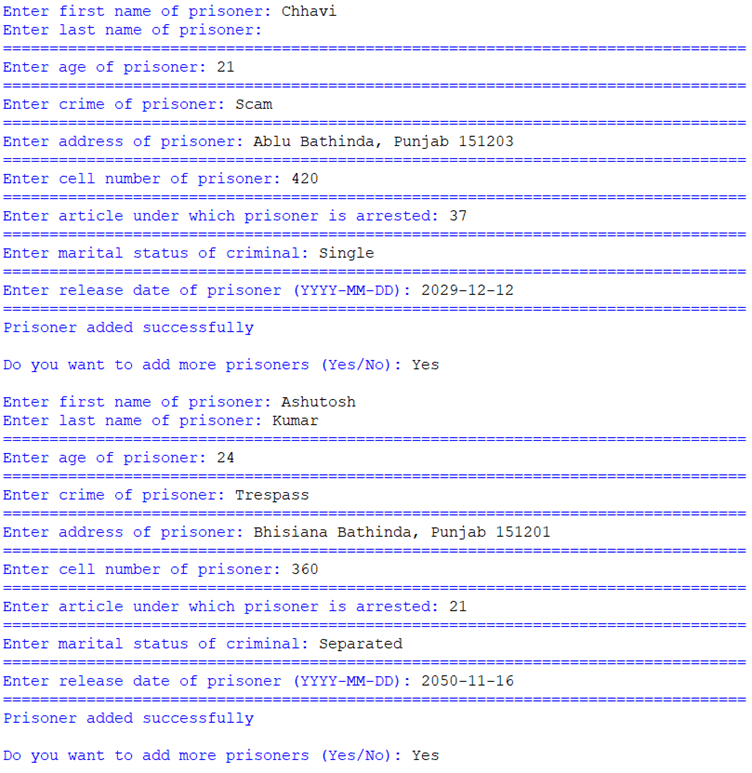
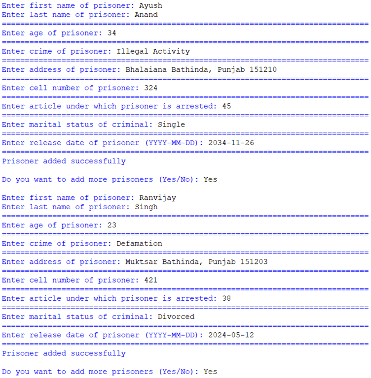
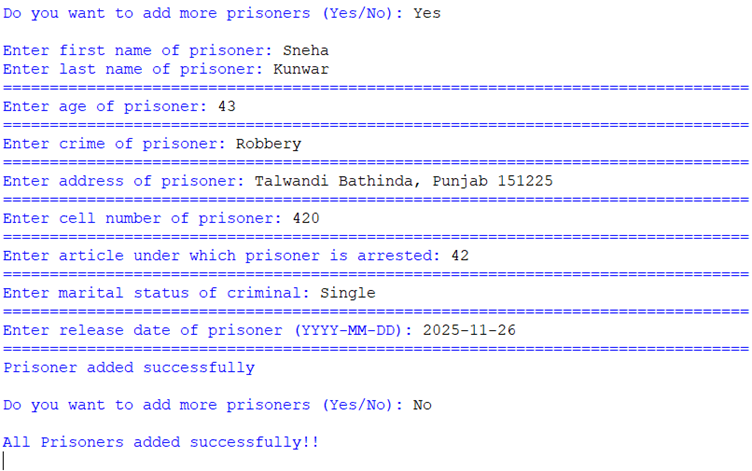
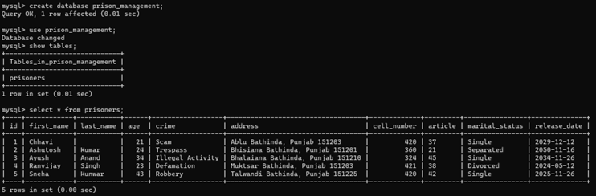

\# Prison Management System

This is a Python-based Prison Management System developed as an

academic project in Class 12.

\## Features

\- Add prisoner details

\- Store data using MySQL

\- Command-line based system

\## Technologies Used

\- Python

\- MySQL

## Screenshots

### Add Prisoner

### Add Multiple Prisoners

### Final Confirmation

### MySQL Database Records

\## Author

Saksham Yadav

